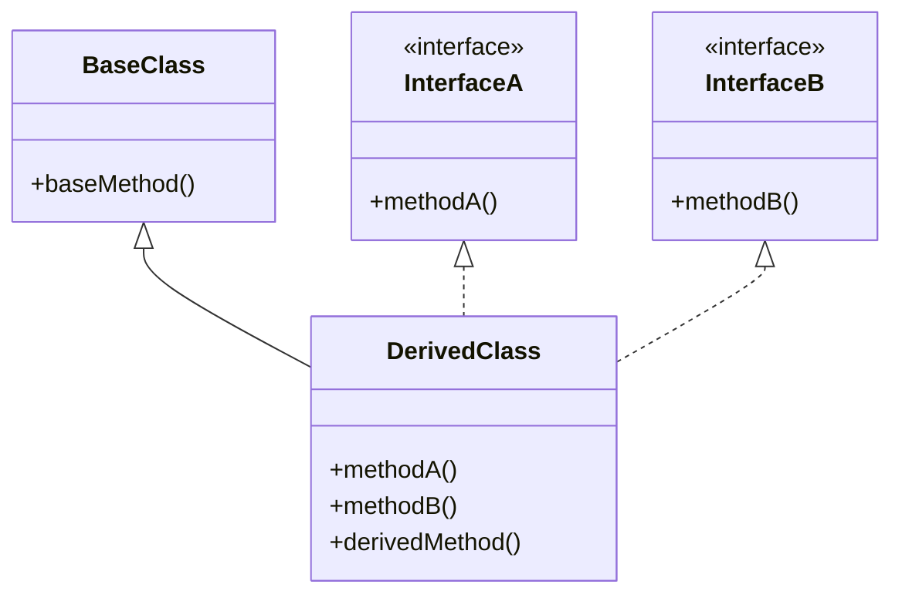
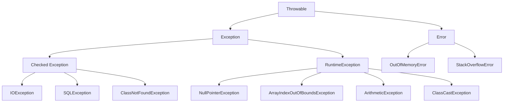

##### 前言 UML图示



##### 对应代码示例

```java
// 定义接口 InterfaceA
interface InterfaceA {
    void methodA();
}

// 定义接口 InterfaceB
interface InterfaceB {
    void methodB();
}

// 定义基类 BaseClass
class BaseClass {
    public void baseMethod() {
        System.out.println("Base method in BaseClass");
    }
}

// 定义继承自 BaseClass 并实现 InterfaceA 和 InterfaceB 的 DerivedClass
class DerivedClass extends BaseClass implements InterfaceA, InterfaceB {

    @Override
    public void methodA() {
        System.out.println("Method A implemented in DerivedClass");
    }

    @Override
    public void methodB() {
        System.out.println("Method B implemented in DerivedClass");
    }

    public void derivedMethod() {
        System.out.println("Derived method in DerivedClass");
    }
}

// 测试类
public class Main {
    public static void main(String[] args) {
        DerivedClass derived = new DerivedClass();
        derived.baseMethod();    // 来自 BaseClass
        derived.methodA();       // 实现自 InterfaceA
        derived.methodB();       // 实现自 InterfaceB
        derived.derivedMethod(); // DerivedClass 特有的方法
    }
}
```


##### 27 异常类



**图解说明：**

- `Throwable` 是所有异常类的根类，继承`Object`，实现了序列化接口，`Exception`和`Error`是两个最重要的子类。
- Exception是 Throwable的子类，表示可恢复的异常。
  - `Checked Exception` 是所有受检异常的统称，需要捕获，需要处理的异常，直接继承自 `Exception` 类。常见的子类有 `IOException`、`SQLException`、`ClassNotFoundException` 等。
  - `RuntimeException` 是所有非受检异常的统称，继承自 `Exception` 类。常见的子类有 `NullPointerException`、`ArrayIndexOutOfBoundsException`、`ArithmeticException`、`ClassCastException` 等。
- `Error` 是 `Throwable` 的另一个子类，表示系统级的严重错误，通常不需要捕获，程序无法自动解决，只有退出运行才能解决。常见的子类有 `OutOfMemoryError` 和 `StackOverflowError`。

##### 28 说说Java异常处理相关的几个关键字，以及简单用法？

throws、throw、try、catch、finally

1. try 包裹执行语句
2. catch指定想要捕获的异常的类型
3. finally确保一段代码不管发生什么异常都要被执行
4. throw明确抛出一个异常
5. throws用来声明一个方法可能抛出的异常

##### 29 try中return A，catch中return B，finally中return C，最终返回值是什么？

```java
public class Example {
    public static void main(String[] args) {
        System.out.println(testMethod());
    }

    public static String testMethod() {
        try {
            //System.out.print(1/0); 异常代码
            return "A";
        } catch (Exception e) {
            return "B";
        } finally {
            return "C";
        }
    }
}
```

解释：

1. **`try` 块**：
   - `try` 块中的代码首先执行，并且因为 `return "A";` 语句的存在，方法会准备返回 "A"。
   - 在准备返回值之前，Java会记住这个返回值，但并不会立即返回，而是继续执行 `finally` 块中的代码。
2. **`catch` 块**：
   - 如果 `try` 块中的代码抛出了异常，那么会进入 `catch` 块。如果没有异常发生，`catch` 块就不会执行。
   - 但无论 `catch` 块是否执行，`finally` 块中的代码始终会执行。
3. **`finally` 块**：
   - `finally` 块中的代码是无论如何都会执行的。即使 `try` 或 `catch` 中有 `return` 语句，`finally` 仍然会在方法返回之前执行。
   - 在 `finally` 块中，如果再次出现 `return` 语句，它会覆盖之前在 `try` 或 `catch` 中准备返回的值，并最终返回 `finally` 中的值。

总结：在try-catch-finally结构中，try和catch中的return的结果都会被暂存，检查finally后有没有return，有则会覆盖；尽量避免在 `finally` 块中使用 `return` 语句，因为这会导致代码的可读性下降和预期外的行为。

##### 30 finally中代码一定会执行吗？

大多数情况下都是会执行的，有一些特殊的情况导致finally块中的代码不执行，如下：

1、**JVM 崩溃**：如果在 `try` 或 `catch` 块执行过程中，JVM 进程突然崩溃（例如内存不足、硬件故障），`finally` 块可能不会执行。

2、**System.exit()**：如果在 `try` 或 `catch` 块中调用了 `System.exit()`，则 JVM 会立即终止，不会再执行 `finally` 块。例如：

```java
public class Example {
    public static void main(String[] args) {
        try {
            System.out.println("In try block");
            System.exit(0);
        } finally {
            System.out.println("In finally block");
        }
    }
}
```

`System.exit(0)` 直接终止了 JVM，导致 `finally` 块没有执行。

3、**无限循环或死锁**：如果在 `try` 块或 `catch` 块中出现了无限循环或死锁，`finally` 块可能永远不会执行，因为程序无法跳出循环或解决死锁。例如：

```java
public class Example {
    public static void main(String[] args) {
        try {
            while (true) {
                // Infinite loop
            }
        } finally {
            System.out.println("In finally block");
        }
    }
}
```

在这种情况下，`finally` 块永远不会被执行，因为程序永远停留在无限循环中。

##### 31 在处理异常的时候，我们应该要注意些什么？

1.`RuntimeException` 不需要显式地 `throws`

**说明**：`RuntimeException` 及其子类属于非受检异常（Unchecked Exception），在方法声明中不需要显式地用 `throws` 关键字抛出这些异常。

2.`catch` 需要先从子类进行捕获

**说明**：在捕获异常时，如果有多个 `catch` 块，需要先捕获具体的子类异常，再捕获通用的父类异常，否则会导致编译错误。

3.始终在 `finally` 中释放资源

**说明**：在使用 `try-catch` 处理异常时，如果有资源需要关闭（如文件、数据库连接等），应在 `finally` 块中释放资源，以确保即使出现异常，资源也能够得到正确的释放。

4.不要在 `finally` 块中使用 `return` 语句

**说明**：在 `finally` 块中使用 `return` 语句会覆盖 `try` 或 `catch` 块中的 `return` 语句，从而导致不可预测的行为

5.只捕获你能处理的异常

**说明**：不要随意捕获所有异常（如捕获 `Exception`），而应该只捕获你能够合理处理的异常。这有助于确保代码更加健壮，并且能够对错误做出合理的响应。

##### 32 什么是AIO、BIO和NIO？


**BIO (Blocking I/O)**:
同步阻塞 I/O，是 JDK 1.4 之前的传统 I/O 模型。线程发起 I/O 请求后，会被阻塞，直到数据准备好并完成 I/O 操作后，线程才能继续执行其他任务。每个 I/O 请求都由一个独立线程处理，因此在高并发情况下容易造成线程资源的浪费和系统负担。

**NIO (Non-Blocking I/O)**:
同步非阻塞 I/O，是 JDK 1.4 引入的 I/O 模型。线程发起 I/O 请求后不会阻塞，而是立即返回。用户线程可以继续处理其他任务，不必等待 I/O 操作完成。通过轮询机制（Selector），线程可以检查 I/O 操作是否已完成，并在数据就绪后进行处理。NIO 允许一个线程处理多个 I/O 连接，显著提高了系统的并发处理能力。

**AIO (Asynchronous I/O)**:
异步非阻塞 I/O，是 JDK 7 引入的 I/O 模型。线程发起 I/O 请求后立即返回，不需要阻塞，也不需要轮询检查操作结果。I/O 操作完成后，系统会自动回调指定的处理函数（CompletionHandler），通知调用方处理结果。AIO 更加高效，适合处理大量并发连接和复杂 I/O 操作的场景。

##### 33 Java是值传递还是引用传递？

**值传递和引用传递最大的区别就是传递过程中有没有复制出来一个副本，如果是传递副本，那就是值传递，否则就是引用传递。Java对象的传递，是通过复制的方式把引用关系传递了，因为有复制的过程，所以是值传递，**只不过对于Java对象的传递，传递的内容是对象的引用。**总的来说，Java只有值传递。**

```java
public class ValueReferenceExample {

    public static void main(String[] args) {
        // 基本数据类型
        int a = 5;
        System.out.println("Before modifyPrimitive: a = " + a);
        modifyPrimitive(a);
        System.out.println("After modifyPrimitive: a = " + a);

        // 对象类型
        MyObject obj = new MyObject();
        obj.value = 10;
        System.out.println("Before modifyObject: obj.value = " + obj.value);
        modifyObject(obj);
        System.out.println("After modifyObject: obj.value = " + obj.value);

        // 对象引用重新分配
        resetObject(obj);
        System.out.println("After resetObject: obj.value = " + obj.value);
    }
	// 值传递，传递的是副本
    public static void modifyPrimitive(int x) {
        x = 10;  // 仅修改了副本，不影响原始变量
    }
	// 引用传递，复制引用地址并进行传递
    public static void modifyObject(MyObject o) {
        o.value = 20;  // 修改对象属性，因为都是指向同一个对象，影响到原始对象
    }

    // 这个重新分配的引用仅在 resetObject 方法内部有效，并不影响 obj 的原始引用。
    public static void resetObject(MyObject o) {
        o = new MyObject();  // 重新分配引用，不影响原始对象
        o.value = 30;  // 修改新对象的属性，原始对象不受影响
    }

}

class MyObject {
    int value;
}
```

##### 34 什么是深拷贝和浅拷贝？

**浅拷贝(Shallow Copy)**: 浅拷贝复制对象时，只复制对象的基本属性和对象的引用，引用对象不复制的实际内容。这意味着拷贝后的对象与原对象共享同一个引用对象的实例。

**深拷贝(Deep Copy)**: 深拷贝不仅复制对象的基本属性，还复制所有引用对象的实际内容。拷贝后的对象和原对象完全独立，没有任何共享的引用。

##### 35 SimpleDateFormat是线程安全的吗？使用时应该注意什么？

**答：**非线程安全的，`SimpleDateFormat` 类在解析或格式化日期时会维护内部状态，比如 `Calendar` 对象，这些状态在多个线程并发访问时可能会相互干扰，导致格式化或解析的结果不正确，甚至可能抛出 `NumberFormatException` 或 `ArrayIndexOutOfBoundsException`。

**如何在多线程环境中安全地使用 `SimpleDateFormat`？**

**局部变量方式**:

- 每次调用 `formatDateWithSimpleDateFormat` 时，都会创建一个新的 `SimpleDateFormat` 实例，确保线程安全。

```java
// 1. 使用局部变量确保线程安全
public String formatDateWithSimpleDateFormat(Date date) {
    SimpleDateFormat sdf = new SimpleDateFormat("yyyy-MM-dd");
    return sdf.format(date);
}
```

**同步块**:

- `formatDateWithSynchronized` 方法使用 `synchronized` 关键字，确保同一时刻只有一个线程可以执行格式化操作，保证线程安全。

```java
// 2. 使用同步块确保线程安全
private static final SimpleDateFormat sharedSdf = new SimpleDateFormat("yyyy-MM-dd");

public synchronized String formatDateWithSynchronized(Date date) {
    return sharedSdf.format(date);
}
```

**使用 `ThreadLocal`**：

- 通过 `ThreadLocal` 为每个线程创建一个 `SimpleDateFormat` 实例，这样每个线程都有自己的实例，既保证了线程安全，又避免了性能问题。

```java
private static final ThreadLocal<SimpleDateFormat> sdf = ThreadLocal.withInitial(() -> new SimpleDateFormat("yyyy-MM-dd"));

public String formatDate(Date date) {
    return sdf.get().format(date);
}
```

**使用替代方案**：

- 从 Java 8 开始，`java.time` 包中的 `DateTimeFormatter` 类提供了不可变的、线程安全的日期时间格式化工具，推荐使用它代替 `SimpleDateFormat`。

```java
private static final DateTimeFormatter formatter = DateTimeFormatter.ofPattern("yyyy-MM-dd");

public String formatDate(LocalDate date) {
    return date.format(formatter);
}
```

##### 36 什么是UUID？

UUID（Universally Unique Identifier），即通用唯一标识符，是一种标准化的128位数字标识符，用于标识信息中的唯一对象。UUID 是根据特定算法生成的，可以在分布式系统中用于唯一地标识信息，无需集中管理。UUID 的主要目的是确保不同时间、不同地点生成的ID是唯一的。

##### 37 char能存储中文吗？

是的，`char` 可以存储中文字符。在Java中，`char` 数据类型是 16 位的无符号整数，使用 Unicode 编码（UTF-16）表示字符。Unicode 是一种字符编码标准，能够表示世界上几乎所有的字符集，包括中文字符。

##### 38 while(true)和for(;;)那个性能好？

都一样，都是做无限循环

##### 39 ClassNotFoundException和NoClassDefFoundError的区别是什么？

* `ClassNotFoundException`发生在 **运行时**，是一个**受检异常**，表示在运行时动态加载类时找不到指定的类。通常由程序的逻辑错误引发，如类名拼写错误、类路径配置不当等。

* `NoClassDefFoundError`也发生在 **运行时**，是一个**错误**，表示 `JVM` 在加载一个已经编译过的类时，无法找到该类。通常由运行时环境的问题引发，如类路径中缺少类、类文件损坏等。